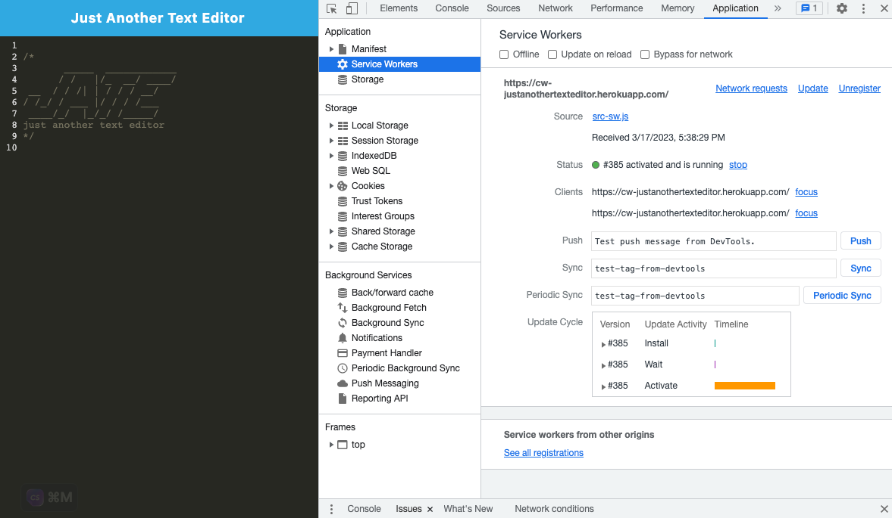

# anotherTextEditor 

## Description

This text editor allows users to be able to create notes or code snippets with or without an internet connection. This is important for users who are on the go and need to be able to reliably retreive their notes or code for later use.

## Table of Contents

- [Installation](#installation)
- [Usage](#usage)
- [How to Contribute](#contributions)
- [Tests](#tests)
- [Credits](#credits)
- [Questions](#questions)

## Installation

To install this text editor, navigate to the [Just Another Text Editor Link](https://) and click on the install button on the top left of the screen. See the picture below:

## 

## Usage

Here are some images displaying how to application works:

## 

## 

## 

## 

## License Description

MIT License

Copyright (c) [2023]

Permission is hereby granted, free of charge, to any person obtaining a copy
of this software and associated documentation files (the "Software"), to deal
in the Software without restriction, including without limitation the rights
to use, copy, modify, merge, publish, distribute, sublicense, and/or sell
copies of the Software, and to permit persons to whom the Software is
furnished to do so, subject to the following conditions:

The above copyright notice and this permission notice shall be included in all
copies or substantial portions of the Software.

THE SOFTWARE IS PROVIDED "AS IS", WITHOUT WARRANTY OF ANY KIND, EXPRESS OR
IMPLIED, INCLUDING BUT NOT LIMITED TO THE WARRANTIES OF MERCHANTABILITY,
FITNESS FOR A PARTICULAR PURPOSE AND NONINFRINGEMENT. IN NO EVENT SHALL THE
AUTHORS OR COPYRIGHT HOLDERS BE LIABLE FOR ANY CLAIM, DAMAGES OR OTHER
LIABILITY, WHETHER IN AN ACTION OF CONTRACT, TORT OR OTHERWISE, ARISING FROM,
OUT OF OR IN CONNECTION WITH THE SOFTWARE OR THE USE OR OTHER DEALINGS IN THE
SOFTWARE.
[MIT License Link](https://choosealicense.com/licenses/mit)

## Contributions

Please contact me if you would like to contribute. You can find my information under the [Questions](#questions) section.

## Tests

N/A

## Credits

Thank you to my study partner's [Rebecca Lawrence](https://github.com/rkml14) and AskBCS Staff!

## Questions

[Cassandra Watson's GitHub Profile](https://github.com/cassiewatsonn)

For any additional questions, please contact me by email at cassiewatsonn@gmail.com !
